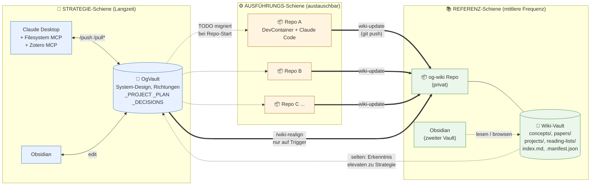
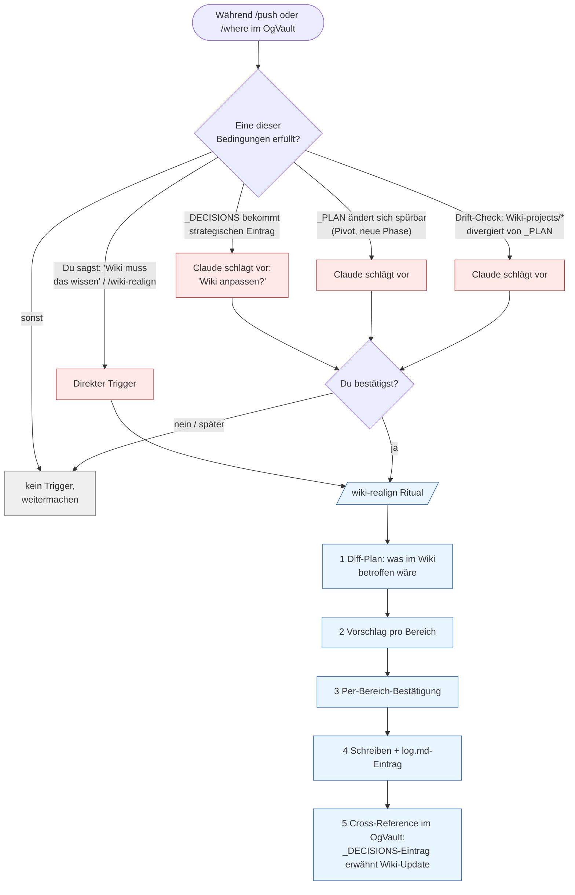
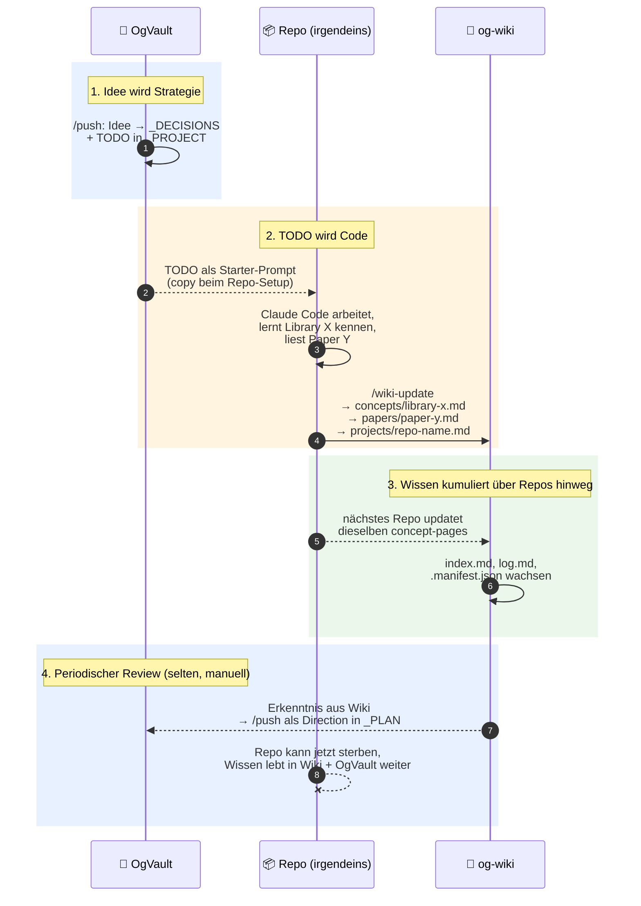

# Claude Research Template — Architektur-Übersicht

> Wie **OgVault**, **Wiki** und **Dev-Repos** zusammenarbeiten, ohne sich gegenseitig im Weg zu stehen.
> Schritt-für-Schritt-Anleitungen liegen in `Setup_Guide.md` und `Setup_Connectors_Windows.md` — diese Datei ist die Architektur-Übersicht.
> Last updated: 2026-05-07

---

## Worum es geht

Über die Zeit haben sich drei Arten von Wissen herausgeschält, die unterschiedlich behandelt werden müssen:

1. **Langzeit-Strategie und System-Design** — gedacht, diskutiert, entschieden. Lebt einmal und entwickelt sich weiter.
2. **Referenz-Wissen** — Paper, Library-Patterns, Integration-Notizen. Wächst durch Code-Arbeit, wird nachgeschlagen.
3. **Ausführung** — konkrete Repos. Kommen, machen ihren Job, gehen.

Diese drei Wissensarten leben in **drei separaten Schienen**, die nur an klar definierten Punkten miteinander reden — nicht durch Auto-Sync, nicht durch ständige Mounts.

---

## Drei Schienen

| Schiene          | Inhalt                                                            | Ort                                       | Frequenz                           |
| ---------------- | ----------------------------------------------------------------- | ----------------------------------------- | ---------------------------------- |
| 🧭 **Strategie**  | OgVault: `_PROJECT`, `_PLAN`, `_DECISIONS`, Scratch, Bibliography | persönlicher Vault auf der Vault-Maschine | mehrmals/Woche                     |
| 📚 **Referenz**   | og-wiki: concepts/, papers/, projects/, reading-lists/            | eigenes (privates) Git-Repo               | wöchentlich bis pro Coding-Session |
| ⚙️ **Ausführung** | austauschbare Code-Repos mit DevContainer                         | beliebige Maschine                        | projektabhängig                    |

### Topologie



**Lesart der Linienstärken:**
- Gestrichelt = manuell, selten, kein Automatismus.
- Fett (Repo → Wiki) = häufig, automatisierbar, Einbahnstraße.
- Doppellinie (Strategie → Wiki) = strukturell wichtig, aber nur auf expliziten Trigger.

---

## Die vier Rituale

Jede Verbindung zwischen den Schienen ist ein eigenes Ritual mit klarem Ein- und Ausgangspunkt. Es gibt **kein** Ritual, das automatisch läuft.

| Richtung       | Ritual                                   | Frequenz             | Wer triggert                    |
| -------------- | ---------------------------------------- | -------------------- | ------------------------------- |
| Chat → OgVault | `/push`                                  | mehrmals pro Woche   | du                              |
| Repo → Wiki    | `wiki-update`                            | pro Coding-Session   | du im DevContainer              |
| OgVault → Wiki | `/wiki-realign`                          | pro Strategiewechsel | du, oder Vorschlag durch Claude |
| Wiki → OgVault | (kein eigenes Ritual, einfacher `/push`) | sehr selten          | du, beim periodischen Review    |

### `/push` — Chat zu OgVault
Das bestehende 5-Schritt-Ritual: Recap → Diff-Plan → Klärung → Schreiben → Closer. Vollständig dokumentiert in `_TEMPLATES/_CLAUDE_PROJECT_SYSTEM_PROMPT.md`.

### `wiki-update` — Repo zu Wiki
Wird im DevContainer ausgeführt, kommt aus dem `obsidian-wiki`-Skill-Pack. Schreibt projekt-spezifisches Wissen nach `wiki/projects/<repo>.md` und Library-/Paper-Notizen nach `wiki/concepts/` bzw. `wiki/papers/`. Nutzt `.manifest.json` für Delta-Tracking, sodass nur tatsächlich Neues geschrieben wird. Beendet mit `git push` ins og-wiki-Repo.

### `/wiki-realign` — OgVault zu Wiki
Der besondere Pfad: das Wiki lernt aus der Strategie, aber **nur an bestimmten Punkten**. Triggert entweder du explizit, oder Claude schlägt es vor wenn:
- ein neuer strategischer Eintrag in `_DECISIONS.md` landet,
- sich `_PLAN.md` spürbar ändert (Pivot, neue Phase, dropped scope),
- der Drift-Check zeigt dass `wiki/projects/*` von `_PLAN.md` divergiert.

**Was Realign konkret tut** (vier typische Effekte):
- **Reading-Lists**: leere Stub-Files unter `wiki/reading-lists/<topic>.md` — Liste von Suchanfragen und gewünschten Paper-Typen, von Repos aufgefüllt
- **Concept-Stubs**: `wiki/concepts/<concept>.md` für Begriffe der neuen Richtung, die im Wiki noch fehlen
- **Project-Page-Update**: `wiki/projects/<repo>.md` bekommt Hinweis "Strategy shifted YYYY-MM-DD, see OgVault `_DECISIONS`"
- **Archivierung**: alte Reading-Lists oder Concept-Pages der abgelösten Richtung wandern nach `wiki/_archive/YYYY-MM-DD_<topic>/` — nicht löschen, damit nachvollziehbar bleibt warum ein Pfad verlassen wurde

**Was Realign nicht tut:**
- Kein Auto-Trigger ohne Bestätigung — der Vorschlag kommt, das Schreiben passiert nur nach OK.
- Keine Übersetzung von Strategie-Volltext ins Wiki — das Wiki bekommt nur strukturelle Konsequenzen, nicht Inhalte aus `_DECISIONS.md`.
- Kein Schreiben in die Gegenrichtung über diesen Pfad.

### Trigger-Logik visualisiert



---

## Lebenszyklus einer Idee

So fließt eine strategische Idee durch das System bis sie als kumuliertes Wissen ankommt:



---

## Wie der NewSpace DevContainer einklinkt

Der DevContainer ist **die Ausführungs-Schiene**. Er muss bewusst nicht auf der Vault-Maschine laufen — Cloud-Runner, Laptop unterwegs, anderer Rechner sind genauso gültig.

### Was der DevContainer für diesen Workflow braucht

| Komponente                           | Zweck                                              | Wo konfiguriert                                                                                             |
| ------------------------------------ | -------------------------------------------------- | ----------------------------------------------------------------------------------------------------------- |
| Claude Code (vorinstalliert)         | Agent, der `wiki-update` und `wiki-query` ausführt | `.devcontainer/devcontainer.json`, Feature `claude-code`                                                    |
| `obsidian-wiki`-Skills               | Definiert, wie das Wiki gepflegt wird              | über `npx skills add Ar9av/obsidian-wiki` oder `setup.sh` im Container, persistiert via `postCreateCommand` |
| Klon des og-wiki-Repos               | Schreibziel für `wiki-update`                      | als Sibling-Verzeichnis oder unter `~/wiki/`, per Git-Credentials                                           |
| Git-Credentials für privates og-wiki | für `git push` aus dem Container                   | SSH-Key-Forwarding oder dedizierter Deploy-Key                                                              |

### Was der DevContainer **nicht** braucht

- **Kein Mount des OgVault.** Der OgVault bleibt auf der Vault-Maschine. Strategische TODOs werden beim Repo-Setup einmal kopiert (als Starter-Prompt oder in eine `TASK.md` im Repo) — das war's.
- **Keinen MCP-Server für Obsidian.** Die MCP-Server sind ausschließlich für Claude Desktop auf der Vault-Maschine relevant. Im Container redet Claude Code direkt mit dem Filesystem.
- **Keine Zotero-Anbindung.** Bibliographie ist Strategie-Zone, lebt im OgVault.

### Verhältnis zu den existierenden DevContainer-Komponenten

Der NewSpace-DevContainer hat bereits:
- Claude Code via `ghcr.io/anthropics/devcontainer-features/claude-code:1`
- `.claude/settings.json` für Team-Defaults
- `.claude/skills/package-docs/` als projekt-spezifische Skill

Die Wiki-Integration ergänzt das durch:
- **Globale** `obsidian-wiki`-Skills (gelten in jedem Repo, nicht nur in NewSpace)
- Eine zusätzliche ENV-Variable `OBSIDIAN_VAULT_PATH` (zeigt im Container auf den og-wiki-Klon, nicht auf den OgVault)

Beide Skill-Mechanismen koexistieren konfliktfrei, solange Skill-Namen sich nicht überschneiden.

---

## Was in diesem Ordner liegt

```
docs/Claude_Research_Template/
├── ReadMe.md                       ← du bist hier (Architektur-Übersicht)
│
├── _PROJECT_TEMPLATES/                     ← Vorlagen für neue Projekte
    ├── Setup_Guide.md                  ← Schritt-für-Schritt-Anleitung, plattform-agnostisch
    ├── Setup_Connectors_Windows.md     ← MCP-Server-Setup für Claude Desktop (Windows)
    ├── _PROJECT.md                     ← Status dieses Templates selbst
│   ├── _CLAUDE_PROJECT_SYSTEM_PROMPT.md
│   ├── _CONVENTIONS.md
│   ├── _PROJECT_TEMPLATE.md
│   ├── _PLAN_TEMPLATE.md
│   ├── _DECISIONS_TEMPLATE.md
│   ├── _SCRATCH_TEMPLATE.md
│   └── archive/                    ← ältere Template-Versionen
│
└── Prompts/                        ← Dr.-Prompts für rollenbasierte Sessions
    ├── Dr_Analyse.md
    ├── Dr_Code.md
    ├── Dr_EveryDay.md
    ├── Dr_Mail.md
    └── archive/                    ← frühere Prompt-Varianten
```

> **Hinweis:** Falls du Files inzwischen anders strukturiert hast, gleicht das tatsächliche Layout mit dem hier dokumentierten ab — die Konzepte ändern sich dadurch nicht, nur die Pfade müssen ggf. nachgezogen werden.

---

## Glossar

**OgVault** — Persönlicher Obsidian-Vault auf der Vault-Maschine. Single Source of Truth für Strategie, Pläne, Entscheidungen und persönliche Notizen. Wird *nicht* als Ganzes versioniert oder geteilt.

**Wiki** (og-wiki) — Eigener, kuratierter Vault als privates Git-Repo. Enthält Concept-, Paper-, Project- und Reading-List-Pages. Wird von DevContainern via `obsidian-wiki`-Skills gepflegt. Auf der Vault-Maschine als zweiter Vault in Obsidian eingebunden (lesend).

**Repo** — Beliebiges Code-Projekt mit DevContainer. Lebt unabhängig, kann jederzeit archiviert werden. Bekommt zum Start strategische TODOs aus dem OgVault, gibt am Ende Wissen ans Wiki zurück.

**`/push`** — 5-Schritt-Ritual zum Schreiben von Chat-Inhalt in den OgVault. Definiert in `_TEMPLATES/_CLAUDE_PROJECT_SYSTEM_PROMPT.md`.

**`wiki-update`** — Skill aus `obsidian-wiki`. Distilliert das aktuelle Repo (README, Source-Struktur, Git-Log) und schreibt es in den Wiki-Vault.

**`wiki-query`** — Skill aus `obsidian-wiki`. Abfrage über Frontmatter und Tags, ohne RAG-Pipeline.

**`/wiki-realign`** — Strategiegetriebener Eingriff ins Wiki: Reading-Lists, Concept-Stubs, Archivierung. Trigger explizit oder durch Claude vorgeschlagen.

**Vault-Maschine** — Die Maschine, auf der OgVault physisch liegt. Hier läuft Claude Desktop mit MCP-Anbindung an OgVault und (lesend) ans og-wiki-Repo.

**Dev-Maschine** — Beliebige Maschine mit Docker und VS Code, auf der ein Repo + DevContainer laufen. Kann, muss aber nicht die Vault-Maschine sein.

---

## Verwandte Dokumente

- `Setup_Guide.md` — Schritt-für-Schritt-Setup für OgVault, Templates, Memory-Edits
- `Setup_Connectors_Windows.md` — MCP-Server-Installation auf Windows mit Claude Desktop
- `_TEMPLATES/_CLAUDE_PROJECT_SYSTEM_PROMPT.md` — Vollständige Definition des `/push`-Rituals und der Pull-Kommandos
- `_TEMPLATES/_CONVENTIONS.md` — Vault-übergreifende Konventionen
- `../../ReadMe.md` (Repo-Root) — Allgemeine NewSpace-DevContainer-Doku
- `../../CLAUDE.md` (Repo-Root) — Projekt-Kontext für Claude Code im Container

---

## Offene Punkte für die Zukunft

Noch nicht entschieden, sollte beim ersten echten Setup geklärt und in `_DECISIONS.md` geloggt werden:

- **Sichtbarkeit des og-wiki-Repos**: privat (empfohlen) vs. öffentlich mit Visibility-Tags. Privat braucht Git-Credentials im Container.
- **Wo der Klon des og-wiki im DevContainer liegt**: als Sibling des Hauptprojekts, unter `~/wiki/`, oder als Submodul. Beeinflusst, wie `wiki-update` den Pfad auflöst.
- **Wie `/wiki-realign` technisch ausgelöst wird**: als eigene Skill im OgVault-Workflow, als Subkommando von `/push`, oder rein konversationell.
- **Wiki-Maschine ≠ Vault-Maschine**: ob das Wiki auf einer dritten Maschine als reiner Git-Mirror lebt (z. B. CI-Runner) oder ob jede Edit-Session Vault- oder Dev-Maschine voraussetzt.
