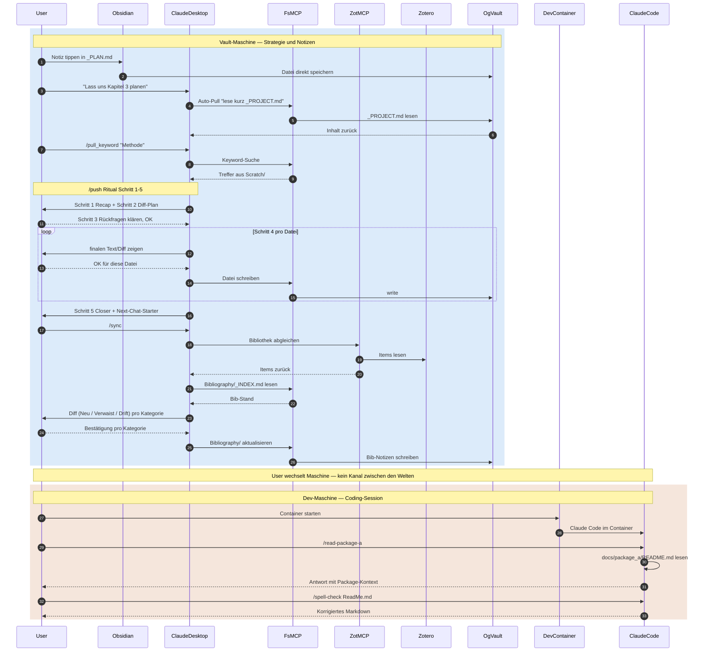

# Claude Research Template

> Strukturierter Research-Workflow für **Claude Desktop + Obsidian**: Chats sind der Brainstorm-Raum, der **Vault ist die einzige Quelle der Wahrheit** für Pläne, Entscheidungen und Notizen.
>
> **Für wen:** Forschende/Wissensarbeiter, die mit Claude Desktop arbeiten und ihre Pläne, Entscheidungen und Notizen in einem Obsidian-Vault persistent halten wollen. **Voraussetzungen:** Claude Desktop, Obsidian-Vault, lokale Maschine zum Installieren von MCP-Servern. **Nicht nötig**, wenn du nur einzelne Chat-Sessions ohne dauerhaftes Wissensmanagement brauchst — dafür reichen die [Dr.-Prompts](#dr-prompts).
> Last updated: 2026-06-09
> Ausblick auf die geplante Drei-Schienen-Architektur mit zusätzlicher Wiki-Schiene — **Vision, noch nicht implementiert**, nicht zum Nachbauen gedacht: [`ReadMe_Future.md`](ReadMe_Future.md). Diese (`ReadMe.md`) beschreibt den heutigen, real funktionierenden Stand.

---

## TL;DR

Dieses Template gibt dir vier Dinge:

1. **Vault-Struktur** mit klaren Rollen pro Datei (`_PROJECT`, `_PLAN`, `_DECISIONS`, `Scratch/`)
2. **System-Prompt** für ein Claude Project, der die Rituale `/push`, `/pull*`, `/sync` und den Drift-Check fest verankert
3. **Setup-Guides** zum Einrichten von Vault + MCP-Servern (Obsidian, Zotero)
4. **Dr.-Prompts** — vier rollenbasierte System-Prompts für wiederkehrende Aufgaben (Code, Analyse, Mail, Alltag)

Du betreibst es heute auf der **Vault-Maschine** (dein Laptop mit Obsidian + Claude Desktop + MCP-Servern — das *Model Context Protocol*, Claude Desktops Brücke zum Dateisystem). Dieses Template lebt zwar im NewDevContainer-Repo, hat aber nichts mit dem dort enthaltenen Python-DevContainer zu tun — der DevContainer läuft komplett unabhängig in einer eigenen Welt. Siehe [Abschnitt zum realen Ablauf](#realer-ablauf-heute-was-wirklich-passiert).

---

## Mentales Modell

```
Chat (flüchtig)           Vault (persistent)
──────────────            ──────────────────
Brainstorming   ──/push──▶  konsolidierte Zustände
Diskutieren                 _PROJECT.md
Iterieren                   _PLAN.md
Verwerfen                   _DECISIONS.md
```

- **Chat = working directory** — Denken erlaubt, falsche Hypothesen okay, alles verwerfbar.
- **Vault = repository** — nur saubere Zustände, dokumentierte Entscheidungen, aktuelle Pläne.
- **Übergang = `/push`** — 5-Schritt-Ritual mit Preview und Bestätigung pro Datei.

Die Trennung ist Absicht. Ohne sie wird entweder der Chat zu vorsichtig (weil alles in den Vault rutschen könnte) oder der Vault verstopft mit Halbgedanken.

---

## Vault-Struktur: was wo lebt

### Flat-Projekt (eine Arbeitsfläche)

```
Projects/[ProjectName]/
├── _PROJECT.md     Status + TODOs
├── _PLAN.md        Roadmap, Phasen, Arbeitspakete
├── _DECISIONS.md   Append-only Entscheidungslog
└── Scratch/        halbgebackene Ideen
```

### Hierarchisches Projekt (Parent + Subprojekte)

```
Projects/[ParentProject]/
├── _PROJECT.md          Parent-Status, übergreifende TODOs
├── _PLAN.md             High-Level-Roadmap
├── _DECISIONS.md        ALLE Entscheidungen (mit [Subproject]-Tag)
├── Scratch/             eine Idea-Bin für alle Subprojekte
│
├── [Subproject_A]/
│   ├── _PLAN.md         Subprojekt-Plan (Pflicht wenn aktiv)
│   └── _DECISIONS.md    optional, nur bei hohem Volumen
│
└── [Subproject_B]/
    └── ...
```

**Regeln:**
- Parent hat immer `_PROJECT.md`, `_PLAN.md`, `_DECISIONS.md`, `Scratch/`.
- Aktives Subprojekt hat immer eigenes `_PLAN.md`.
- `_DECISIONS.md` im Subprojekt nur bei großem Volumen — sonst Tag im Parent-Log.
- `Scratch/` lebt **nur** auf Parent-Ebene (keine Fragmentierung).
- Kein Subprojekt-im-Subprojekt. Tiefer = einfache Ordner ohne Meta-Files.

### Was jede Datei macht

| Datei            | Zweck                                            | Wer schreibt          | Format                                  |
| ---------------- | ------------------------------------------------ | --------------------- | --------------------------------------- |
| `_PROJECT.md`    | Status, Phase, Next Milestone, TODOs             | Claude nur via `/push` | Status-Tabelle + Flat-TODO-Liste        |
| `_PLAN.md`       | Roadmap, Phasen, Arbeitspakete, Risiken          | Claude nur nach OK   | Phasen mit Definition-of-Done + Risiko-Tabelle |
| `_DECISIONS.md`  | Append-only Entscheidungslog, neueste oben       | Claude nur via `/push` | Pro Eintrag: Context / Options / Decision / Impact |
| `Scratch/`       | Brainstorm, Halbgedanken, datierte Notizen      | User & Claude frei     | Datierte Einträge oben, beliebige Form  |
| `Bibliography/`  | Optional: Paper-Notizen + `_INDEX.md`            | Claude via `/sync`    | Pro Paper eine `[CitationKey].md`       |

Vorlagen liegen unter [`_PROJECT_TEMPLATES/`](_PROJECT_TEMPLATES/) — jede mit Platzhaltern, die du beim Setup ersetzt.

---

## Die Rituale

Vier Rituale halten Chat und Vault synchron, ohne dass etwas heimlich passiert.

### `/push` — Konsolidierung Chat → Vault

Das einzige Ritual, das schreibt. Fünf Schritte, keine Abkürzungen.

| Schritt | Was passiert                                                              | Wer bestätigt |
| ------- | ------------------------------------------------------------------------- | ------------- |
| 1       | **Recap** — Claude fasst Session zusammen: Decisions, Insights, Plan-Änderungen, offene Punkte | User korrigiert ggf. |
| 2       | **Vault-Diff-Plan** — Claude liest Vault-Files, beschreibt Änderungen *in Prosa* (noch kein Write) | User sieht *intent* |
| 3       | **Rückfragen** — Claude klärt: "Decision oder offene Ablation?", "TODO done/in progress/deferred?" | User antwortet |
| 4       | **Schreiben** — pro Datei: finaler Text/Diff zeigen → OK abwarten → schreiben | User OK pro Datei |
| 5       | **Closer** — kurze Zusammenfassung + Next-Chat-Starter zum Reinpasten      | —             |

**Leer-Push:** Wenn nichts konsolidierungswürdig ist, sagt Claude das ehrlich und beendet das Ritual sofort. Kein Pseudo-Push.

### `/pull` — Vault → Chat lesen

Alle Pull-Mechanismen sind **read-only** und blockieren das Gespräch nie.

| Mechanismus              | Was passiert                                                            |
| ------------------------ | ----------------------------------------------------------------------- |
| Auto-Pull (automatisch)  | Bei Statusfragen, Verweisen auf Decisions, Paper-Bezügen — mit transparentem Hinweis "lese kurz X" |
| `/pull`                  | Voller Refresh: Parent + alle aktiven Subprojekt-Meta-Files             |
| `/pull_path <path>`      | Gezielt; bei mehrdeutigem Namen Liste + Rückfrage; bei riesigen Files Whole-or-Section |
| `/pull_keyword <term>`   | Volltextsuche im aktuellen Projekt, Treffer mit Snippets, dann Auswahl  |
| `/pull_subproject <name>` | `[Subproject]/_PLAN.md` + optional `_DECISIONS.md`                     |
| `/where`                 | Meta-Synthese: wo stehen wir, was wurde vereinbart, was fehlt           |

Typische Auto-Pull-Reihenfolge: `_PROJECT.md` → `_PLAN.md` → `_DECISIONS.md` → spezifische Subfiles.

### `/sync` — Zotero ↔ Obsidian

Bibliographie-Abgleich zwischen Zotero (Master für Metadaten) und Obsidian (Master für persönliche Notizen).

1. Aktive Zotero-Collection ziehen
2. `Bibliography/_INDEX.md` + `Bibliography/[CitationKey].md` aus dem Vault lesen
3. Diff anzeigen: **Neu in Zotero** / **Verwaist in Obsidian** / **Metadata-Drift**
4. Pro Kategorie nachfragen, was passieren soll
5. Erst nach Bestätigung anwenden, Closer-Summary

Was `/sync` **nicht** tut: keine Push-Richtung Obsidian → Zotero (Adds via `zotero_add_by_doi`), kein Auto-Löschen verwaister Notizen (nur markieren), keine Modifikation bestehender Notiz-Bodies (nur Metadata-Header).

### Drift-Check (zyklisch)

Alle 3–4 substantielle Wechsel macht Claude einen kompakten Cross-Check:

> "Quick check: wir haben jetzt A, B, C diskutiert. Der Vault hat X, Y. Drift-Beobachtung: [konkreter Punkt]. Weitermachen oder zuerst klären?"

Kein Reflex, keine Korrektur-Schleife — ein **Frühwarnsystem**, damit Chat-Realität und Vault-Stand nicht auseinanderlaufen. Bei laufendem Gedankengang: bis zur nächsten Pause verschieben.

---

## Realer Ablauf heute: was wirklich passiert

Im Gegensatz zur Zukunftsvision in [`ReadMe_Future.md`](ReadMe_Future.md) zeigt dieses Diagramm **ausschließlich**, was heute existiert — keine geplanten Bausteine, keine Wunschverbindungen. Beide Maschinen erscheinen als parallele Lanes mit eigenem Zeitstrahl und eigener Farbe. Von oben nach unten: erst der Vault-Alltag mit Obsidian, Claude Desktop und MCP-Servern, dann der bewusste Maschinenwechsel des Users, dann die isolierte Coding-Session im DevContainer. Dass keine einzige Pfeillinie die Lane-Grenze überschreitet, ist die zentrale Aussage.


```mermaid
sequenceDiagram
    autonumber
    participant User as User
    participant Obs as Obsidian
    participant CD as ClaudeDesktop
    participant Fs as FsMCP
    participant Zot as ZotMCP
    participant ZA as Zotero
    participant Vault as OgVault
    participant DC as DevContainer
    participant CC as ClaudeCode

    rect rgb(220, 235, 250)
        Note over User,Vault: Vault-Maschine — Strategie und Notizen
        User->>Obs: Notiz tippen in _PLAN.md
        Obs->>Vault: Datei direkt speichern
        User->>CD: "Lass uns Kapitel 3 planen"
        CD->>Fs: Auto-Pull "lese kurz _PROJECT.md"
        Fs->>Vault: _PROJECT.md lesen
        Vault-->>CD: Inhalt zurück
        User->>CD: /pull_keyword "Methode"
        CD->>Fs: Keyword-Suche
        Fs-->>CD: Treffer aus Scratch/
        Note over User,CD: /push Ritual Schritt 1-5
        CD->>User: Schritt 1 Recap + Schritt 2 Diff-Plan
        User-->>CD: Schritt 3 Rückfragen klären, OK
        loop Schritt 4 pro Datei
            CD->>User: finalen Text/Diff zeigen
            User-->>CD: OK für diese Datei
            CD->>Fs: Datei schreiben
            Fs->>Vault: write
        end
        CD->>User: Schritt 5 Closer + Next-Chat-Starter
        User->>CD: /sync
        CD->>Zot: Bibliothek abgleichen
        Zot->>ZA: Items lesen
        Zot-->>CD: Items zurück
        CD->>Fs: Bibliography/_INDEX.md lesen
        Fs-->>CD: Bib-Stand
        CD->>User: Diff (Neu / Verwaist / Drift) pro Kategorie
        User-->>CD: Bestätigung pro Kategorie
        CD->>Fs: Bibliography/ aktualisieren
        Fs->>Vault: Bib-Notizen schreiben
    end

    Note over User,CC: User wechselt Maschine — kein Kanal zwischen den Welten

    rect rgb(245, 230, 220)
        Note over User,CC: Dev-Maschine — Coding-Session
        User->>DC: Container starten
        DC->>CC: Claude Code im Container
        User->>CC: /read-package-a
        CC->>CC: docs/package_a/README.md lesen
        CC-->>User: Antwort mit Package-Kontext
        User->>CC: /spell-check ReadMe.md
        CC-->>User: Korrigiertes Markdown
    end
```

Der **blaue Block** oben ist die **Vault-Maschine** mit Obsidian, Claude Desktop, den beiden MCP-Servern (Filesystem und Zotero), der Zotero-App und dem OgVault. Hier laufen die Lese-Rituale (Auto-Pull, `/pull_keyword`), das `/push`-Schreibritual mit seiner Pro-Datei-Schleife in Schritt 4 sowie der Zotero-Abgleich `/sync`. Die Note in der Mitte markiert den **Maschinenwechsel**. Der **orange Block** unten ist die **Dev-Maschine** mit DevContainer und Claude Code, die nur die lokalen Slash-Commands `/read-package-a` und `/spell-check` kennt. Zwischen den beiden Blöcken existiert heute **kein einziger Pfeil** — keine MCP-Brücke, kein gemeinsamer Mount, keine geteilte Datei. Der User ist die einzige Verbindung.

---

## Setup (Quickstart)

Vollständige Anleitungen liegen in den Setup-Guides. Hier nur die Schritt-Übersicht.

### 1. Vault & Ordnerstruktur

Lege in deinem Obsidian-Vault einen `Projects/`-Ordner an und darin pro Projekt eine Mappe wie oben beschrieben. Vorlagen kopieren:

**macOS / Linux / Git Bash:**
```bash
cp _PROJECT_TEMPLATES/_PROJECT_TEMPLATE.md     <vault>/Projects/MyProject/_PROJECT.md
cp _PROJECT_TEMPLATES/_PLAN_TEMPLATE.md        <vault>/Projects/MyProject/_PLAN.md
cp _PROJECT_TEMPLATES/_DECISIONS_TEMPLATE.md   <vault>/Projects/MyProject/_DECISIONS.md
mkdir <vault>/Projects/MyProject/Scratch
```

**Windows PowerShell:**
```powershell
Copy-Item _PROJECT_TEMPLATES\_PROJECT_TEMPLATE.md     <vault>\Projects\MyProject\_PROJECT.md
Copy-Item _PROJECT_TEMPLATES\_PLAN_TEMPLATE.md        <vault>\Projects\MyProject\_PLAN.md
Copy-Item _PROJECT_TEMPLATES\_DECISIONS_TEMPLATE.md   <vault>\Projects\MyProject\_DECISIONS.md
New-Item -ItemType Directory <vault>\Projects\MyProject\Scratch
```

> Aktuell ist das Kopieren manuell. Ein Deployment-Skript gibt es noch nicht — siehe [Was dieses Template heute NICHT macht](#was-dieses-template-heute-nicht-macht).

### 2. MCP-Server installieren

Damit Claude Desktop den Vault lesen/schreiben kann, brauchst du zwei MCP-Server (kleine Node-/Python-Prozesse, die Claude Desktop beim Start mit-startet):

- **Filesystem MCP** (auch als „Obsidian MCP" konfiguriert) — Lese-/Schreibzugriff auf Vault-Dateien. Pflicht.
- **Zotero MCP** — Bibliographie-Sync. Optional.

Konkret bedeutet das: einen Eintrag pro Server in `claude_desktop_config.json` ergänzen und Claude Desktop neu starten. Schritt-für-Schritt mit Pfaden und JSON-Snippets: [`_PROJECT_TEMPLATES/Setup_Connectors_Windows.md`](_PROJECT_TEMPLATES/Setup_Connectors_Windows.md) (Windows). Plattformübergreifender Guide: [`_PROJECT_TEMPLATES/Setup_Guide.md`](_PROJECT_TEMPLATES/Setup_Guide.md).

### 3. Claude Project anlegen

In Claude Desktop ein neues Project erstellen, dann den System-Prompt aus [`_PROJECT_TEMPLATES/_CLAUDE_PROJECT_SYSTEM_PROMPT.md`](_PROJECT_TEMPLATES/_CLAUDE_PROJECT_SYSTEM_PROMPT.md) einfügen und alle `[PLACEHOLDERS]` mit deinen Werten ersetzen:

- `[PROJECT_NAME]`, `[USER_NAME]`, `[DOMAIN]`, `[SHORT_DESCRIPTION]`
- `[VAULT_ROOT_PATH]`, `[PROJECT_FOLDER]`
- `[COLLECTION_KEY]`, `[COLLECTION_NAME]` (nur wenn Zotero genutzt wird)
- `[REPO_URL]` (optional)

Konventionen, die alle Projekte teilen, stehen in [`_PROJECT_TEMPLATES/_CONVENTIONS.md`](_PROJECT_TEMPLATES/_CONVENTIONS.md).

### 4. Erste Session

- Chat öffnen, etwas brainstormen
- Bei einer Statusfrage: Claude macht **Auto-Pull** und liest `_PROJECT.md`
- Wenn etwas konsolidierungswürdig ist: `/push` — das 5-Schritt-Ritual startet
- Am Ende: **Next-Chat-Starter** (kurzer Kontext-Block, den Claude in Schritt 5 ausgibt) kopieren und als erste Nachricht in die nächste Session einfügen

---

## Dr.-Prompts

Vier rollenbasierte System-Prompts unter [`Prompts/`](Prompts/) — der Name kommt daher, dass jeder Prompt eine fiktive Fach-Persona definiert (Dr. EveryDay, Dr. Code, Dr. Analyse, Dr. Mail). Sie sind für Sessions gedacht, die **kein** Projekt-Vault brauchen:

| Prompt                                              | Rolle                                                                  |
| --------------------------------------------------- | ---------------------------------------------------------------------- |
| [`Dr_EveryDay.md`](Prompts/Dr_EveryDay.md)         | Alltagsfragen mit harter Source-Verification-Pflicht und Anti-Halluzinations-Regeln |
| [`Dr_Code.md`](Prompts/Dr_Code.md)                  | Programmier-Assistent: vollständige Dateien, Doxygen-Doku, sauberer Stil |
| [`Dr_Analyse.md`](Prompts/Dr_Analyse.md)            | Text- und Kommunikationsoptimierung mit psychologischer Analyse        |
| [`Dr_Mail.md`](Prompts/Dr_Mail.md)                  | Business- und formelle E-Mails: kurz, präzise, ohne Erfindung           |

Verwendung: Inhalt kopieren, in ein Claude Project oder eine Custom-GPT-Konfiguration einfügen, fertig. Sie funktionieren unabhängig von Vault und MCP.

---

## Folder-Layout

```
docs/Claude_Research_Template/
├── ReadMe.md                          ← du bist hier (echte README, aktueller Stand)
├── ReadMe_Future.md                   ← Zukunftsbild mit Wiki-Schiene
├── temp.md                            ← Arbeitsnotiz (kein Bestandteil)
│
├── _PROJECT_TEMPLATES/                ← Vorlagen für neue Projekte
│   ├── Setup_Guide.md                 ← Setup plattformübergreifend
│   ├── Setup_Connectors_Windows.md    ← MCP-Server auf Windows
│   ├── _CLAUDE_PROJECT_SYSTEM_PROMPT.md ← System-Prompt fürs Claude Project
│   ├── _CONVENTIONS.md                ← Vault-übergreifende Konventionen
│   ├── _PROJECT_TEMPLATE.md           ← Vorlage für _PROJECT.md
│   ├── _PLAN_TEMPLATE.md              ← Vorlage für _PLAN.md
│   ├── _DECISIONS_TEMPLATE.md         ← Vorlage für _DECISIONS.md
│   ├── _SCRATCH_TEMPLATE.md           ← Vorlage für Scratch-Notizen
│   ├── _PROJECT.md                    ← Status dieses Templates selbst
│   └── archive/                       ← ältere Template-Versionen
│
└── Prompts/                           ← Dr.-Prompts (rollenbasierte System-Prompts)
    ├── Dr_EveryDay.md
    ├── Dr_Code.md
    ├── Dr_Analyse.md
    ├── Dr_Mail.md
    └── archive/                       ← frühere Prompt-Varianten
```

---

## Was dieses Template heute NICHT macht

Damit du nicht nach Funktionen suchst, die nicht da sind:

- **Keine Wiki-Schiene.** Kein `og-wiki` Repo, kein `wiki-update` Skill, kein `/wiki-realign`. Die Idee dazu steht in [`ReadMe_Future.md`](ReadMe_Future.md), umgesetzt ist sie nicht.
- **Kein Auto-Deployment der Templates.** Du kopierst die `_*.md`-Vorlagen manuell in deinen Vault. Ein Skript dafür existiert nicht.
- **Keine Integration mit dem DevContainer dieses Repos.** Der DevContainer (Claude Code + `package-docs`) lebt in einer eigenen Welt. Er hat keinen Vault-Zugriff und keine MCP-Server installiert. Siehe Diagramm oben.
- **Kein Push Obsidian → Zotero.** `/sync` zieht nur in eine Richtung — Adds gehen über `zotero_add_by_doi`.
- **Kein Auto-Trigger für `/push`.** Konsolidierung passiert immer nur, wenn der User es explizit anstößt.

---

## Glossar

**OgVault** — Persönlicher Obsidian-Vault, Single Source of Truth für Strategie, Pläne, Entscheidungen, persönliche Notizen.

**Vault-Maschine** — Die Maschine, auf der dein OgVault physisch liegt und Claude Desktop mit MCP-Anbindung läuft.

**Claude Project** — Eine Projekt-Hülle in Claude Desktop, die den System-Prompt + Custom Instructions trägt. Pro Vault-Projekt eines.

**MCP** (Model Context Protocol) — Brücke zwischen Claude Desktop und externen Systemen (Filesystem, Zotero). Macht den Vault für Claude lesbar/schreibbar.

**Auto-Pull** — Automatisches Lesen relevanter Vault-Files bei substantiellen Fragen, immer mit transparentem Hinweis.

**`/push`** — 5-Schritt-Ritual: Recap → Diff-Plan → Rückfragen → Schreiben (pro Datei nach OK) → Closer.

**`/pull*`** — Familie expliziter Read-Befehle: `/pull`, `/pull_path`, `/pull_keyword`, `/pull_subproject`, `/where`.

**`/sync`** — Zotero ↔ Obsidian Bibliographie-Abgleich, Diff-basiert, pro Kategorie bestätigt.

**Drift-Check** — Kompakter Cross-Check alle 3–4 substantielle Wechsel: gleicht Chat-Realität mit Vault-Stand ab.

**Subprojekt** — Eingebettetes Arbeitsthema mit eigenem `_PLAN.md` unter einem Parent-Projekt. Decisions tagsweise im Parent-Log.

---

## Verwandte Dokumente

- [`ReadMe_Future.md`](ReadMe_Future.md) — Zukunftsbild mit Wiki-Schiene und Drei-Schienen-Architektur (Soll, nicht gebaut)
- [`_PROJECT_TEMPLATES/Setup_Guide.md`](_PROJECT_TEMPLATES/Setup_Guide.md) — vollständiger plattformübergreifender Setup
- [`_PROJECT_TEMPLATES/Setup_Connectors_Windows.md`](_PROJECT_TEMPLATES/Setup_Connectors_Windows.md) — MCP-Server auf Windows
- [`_PROJECT_TEMPLATES/_CLAUDE_PROJECT_SYSTEM_PROMPT.md`](_PROJECT_TEMPLATES/_CLAUDE_PROJECT_SYSTEM_PROMPT.md) — der System-Prompt
- [`_PROJECT_TEMPLATES/_CONVENTIONS.md`](_PROJECT_TEMPLATES/_CONVENTIONS.md) — Vault-übergreifende Regeln
- [`../../ReadMe.md`](../../ReadMe.md) — Repo-Root-Onboarding (DevContainer-Doku)
- [`../../CLAUDE.md`](../../CLAUDE.md) — Projekt-Kontext für Claude Code im Container
