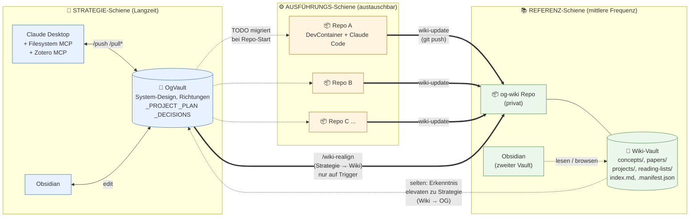
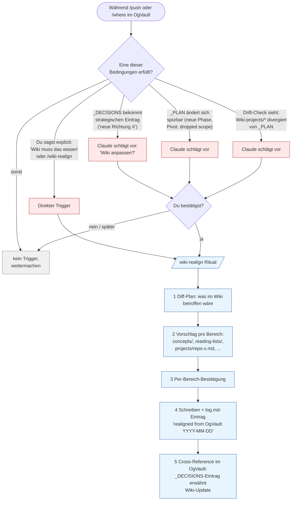

Ah, jetzt ist die Asymmetrie klar: Wiki *darf* aus Strategie lernen, aber nur durch ein **explizites, beidseitig vorschlagbares Ritual** — nicht durch Auto-Sync und nicht durch ständiges Mounten. Strategiewechsel im OgVault → ggf. neue Reading-List, neue Concept-Stubs, neue Paper-Ordner-Struktur im Wiki.

Wichtig daran: Es ist *kein zweiter Datenfluss in Echtzeit*. Es ist ein bewusster Trigger, den entweder du auslöst ("Strategiewechsel, Wiki anpassen") oder ich vorschlage ("In den letzten drei `/push` ist X dreimal als neue Richtung aufgetaucht — willst du das im Wiki spiegeln?").

## Diagramm 1 — Drei Schienen mit dem zusätzlichen Strategie→Wiki-Pfad

Das `===>` zwischen OG und Wiki ist der neue, explizite Pfad — mit dem Hinweis "nur auf Trigger". Eine fette Linie, weil sie *strukturelle* Auswirkung hat (Reading-Lists, Concept-Stubs, ggf. Ordner-Reorgs), keine kontinuierliche.

## Diagramm 2 — Wann der Strategie→Wiki-Trigger feuert

## Was das `wiki-realign`-Ritual *konkret* anfasst

Damit der Pfad nicht nebulös bleibt — vier typische Realign-Effekte:

- **Reading-Lists**: `wiki/reading-lists/<topic>.md` — Liste von Papers die zur neuen Richtung passen. Stub mit Suchanfragen, nicht ausgefüllt. Die Repos füllen sie auf.
- **Concept-Stubs**: leere `wiki/concepts/<concept>.md`-Files für Begriffe die in der neuen Strategie auftauchen aber im Wiki noch nicht existieren. Repos schreiben sie aus, wenn sie über den Concept stolpern.
- **Project-Page-Update**: `wiki/projects/<repo>.md` bekommt einen Hinweis "Strategy shifted YYYY-MM-DD, see OgVault `_DECISIONS`". Damit landet beim nächsten `wiki-query` der Hinweis im Kontext.
- **Archivierung**: alte Reading-Lists oder Concept-Pages, die zur abgelösten Richtung gehörten, wandern nach `wiki/_archive/YYYY-MM-DD_<topic>/`. Nicht löschen — du willst nachverfolgen können, *warum* eine Richtung verlassen wurde.

## Was das Ritual *nicht* tut

- Kein Auto-Trigger ohne deine Bestätigung. Auch wenn die Bedingung "neue Richtung in `_DECISIONS`" klar zutrifft — der Vorschlag kommt, das Schreiben passiert nur nach OK.
- Keine Übersetzung von Strategie-Inhalt 1:1 ins Wiki. Strategie bleibt im OgVault. Das Wiki bekommt nur *strukturelle Konsequenzen*: neue Stubs, neue Listen, Archivierung — keine Volltexte aus `_DECISIONS`.
- Kein Schreiben von Repos ins OgVault über diesen Pfad. Die andere Richtung (Wiki → OgVault) bleibt komplett manuell und seltener.

## Symmetrie-Check

Damit hast du jetzt drei explizite Rituale, eines pro Richtung:

| Richtung       | Ritual                                   | Frequenz             | Wer triggert                 |
| -------------- | ---------------------------------------- | -------------------- | ---------------------------- |
| Chat → OgVault | `/push`                                  | mehrmals pro Woche   | du                           |
| Repo → Wiki    | `wiki-update`                            | pro Coding-Session   | du im DevContainer           |
| OgVault → Wiki | `wiki-realign`                           | pro Strategiewechsel | du, oder ich schlage vor     |
| Wiki → OgVault | (kein eigenes Ritual, manueller `/push`) | sehr selten          | du, beim periodischen Review |

Die letzte Zeile ist absichtlich kein eigenes Ritual — wenn das Wiki etwas Strategisches enthält, gehört der Anlass für einen `/push` direkt in deinen normalen OgVault-Flow. Mehr Mechanik dort wäre Overengineering.

## Eine Sache zum Validieren

Mein Vorschlag enthält die Annahme, dass Wiki-Strukturänderungen (Stubs, Listen, Archivierung) ausreichen — ohne dass das Wiki *Strategie-Text* spiegelt. Sehe ich das richtig, oder willst du dass `wiki-realign` z. B. auch eine kurze "current strategic direction"-Notiz im Wiki hinterlässt, damit Claude Code im DevContainer beim `wiki-query` automatisch mitliest *wohin* das Projekt gerade zielt?
